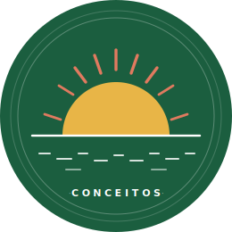

<div align="center">
  
  <h1>Conceitos</h1>
  <p>Imaginando um futuro digital para Moçambique.</p>
  <a href="https://conceitos.org">conceitos.org</a>
</div>

---

**Conceitos** é uma iniciativa cívica que reimagina serviços públicos digitais moçambicanos através de mocks e protótipos visuais. Cada projecto é um conjunto de interfaces clicáveis: ideias para conversar, criticar e melhorar, não software em produção.

Este repositório contém o código-fonte do site [conceitos.org](https://conceitos.org), servido via GitHub Pages.

## Projectos

| # | Projecto | Estado |
|---|----------|--------|
| 01 | [Saúde Digital](https://conceitos.org/projectos/saudedigital/) | Disponível |
| 02 | [Governo Digital](https://conceitos.org/projectos/governodigital/) | Disponível |
| 03 | [Educação Digital](https://conceitos.org/projectos/educacaodigital/) | Disponível |
| 04 | [Finanças Digitais](https://conceitos.org/projectos/financasdigitais/) | Disponível |
| 05 | [Justiça Digital](https://conceitos.org/projectos/justicadigital/) | Disponível |
| 06 | [Trabalho Digital](https://conceitos.org/projectos/trabalhodigital/) | Disponível |
| 07 | [Transportes Digitais](https://conceitos.org/projectos/transportesdigitais/) | Disponível |

### Saúde Digital

Reimaginação da plataforma nacional de saúde com cinco superfícies interligadas: registo clínico electrónico (EMR), app do cidadão, farmácia comunitária, vigilância epidemiológica e auditoria clínica.

### Governo Digital

Reimaginação dos serviços de governação civil e transparência do Estado com cinco superfícies: bilhete de identidade electrónico (eBI), app do cidadão, balcão de atendimento digitalizado, orçamento aberto e auditoria pública.

### Educação Digital

Reimaginação da plataforma nacional de educação com cinco superfícies: gestão escolar integrada (SIGE), portal do professor, caderno electrónico do aluno, biblioteca pública nacional e portal de matrículas.

### Finanças Digitais

Reimaginação do sistema fiscal e orçamental com cinco superfícies: portal do cidadão (NUIT e IRS pessoal), declaração comercial (IRPC), eFactura para independentes e comerciantes, portal da Autoridade Tributária e interoperabilidade com a SISTAFE.

### Justiça Digital

Reimaginação do acesso à justiça com cinco superfícies: portal do cidadão (acompanhamento processual e certidões), tribunal comunitário digitalizado, cadastro predial, portal do MJCR e registos públicos (civil, comercial e predial).

### Trabalho Digital

Reimaginação do sistema de trabalho e protecção social com cinco superfícies: portal do trabalhador, portal do empregador, INSS (segurança social), IGT (inspecção do trabalho) e INEFP (formação profissional).

### Transportes Digitais

Reimaginação do sistema nacional de transportes com cinco superfícies: portal do condutor, portal do operador, INATTER (inspecção e licenciamento), transporte multimodal e PRM (passagem de fronteira).

## Estrutura

```
conceitos/
├── index.html               # Página de entrada e directório de projectos
├── assets/                  # Marca, SVGs partilhados
└── projectos/
    ├── saudedigital/        # Projecto 01 · Saúde Digital
    │   ├── index.html
    │   ├── emr.html
    │   ├── ehealth.html
    │   ├── pharmacy.html
    │   ├── audit.html
    │   ├── surveillance.html
    │   ├── design-system.html
    │   ├── shared/styles.css
    │   └── DESIGN-*.md
    ├── governodigital/      # Projecto 02 · Governo Digital
    │   ├── index.html
    │   ├── ebi.html
    │   ├── cidadao.html
    │   ├── balcao.html
    │   ├── orcamento.html
    │   ├── auditoria.html
    │   ├── design-system.html
    │   ├── shared/styles.css
    │   └── DESIGN-*.md
    ├── educacaodigital/     # Projecto 03 · Educação Digital
    │   ├── index.html
    │   ├── sige.html
    │   ├── professor.html
    │   ├── aluno.html
    │   ├── biblioteca.html
    │   ├── matriculas.html
    │   ├── design-system.html
    │   ├── shared/styles.css
    │   └── DESIGN-*.md
    ├── financasdigitais/    # Projecto 04 · Finanças Digitais
    │   ├── index.html
    │   ├── cidadao.html
    │   ├── comercial.html
    │   ├── efactura.html
    │   ├── portal-at.html
    │   ├── sistafe.html
    │   ├── design-system.html
    │   ├── shared/styles.css
    │   └── DESIGN-*.md
    ├── justicadigital/      # Projecto 05 · Justiça Digital
    │   ├── index.html
    │   ├── cidadao.html
    │   ├── comunitario.html
    │   ├── cadastro.html
    │   ├── portal-mjcr.html
    │   ├── registos.html
    │   ├── design-system.html
    │   ├── shared/styles.css
    │   └── DESIGN-*.md
    ├── trabalhodigital/     # Projecto 06 · Trabalho Digital
    │   ├── index.html
    │   ├── trabalhador.html
    │   ├── empregador.html
    │   ├── inss.html
    │   ├── igt.html
    │   ├── inefp.html
    │   ├── design-system.html
    │   ├── shared/styles.css
    │   └── DESIGN-*.md
    └── transportesdigitais/ # Projecto 07 · Transportes Digitais
        ├── index.html
        ├── condutor.html
        ├── operador.html
        ├── inatter.html
        ├── multimodal.html
        ├── prm.html
        ├── design-system.html
        ├── shared/styles.css
        └── DESIGN-*.md
```

## Tecnologia

Site estático puro: HTML5, CSS3 com variáveis de design, SVG e JavaScript mínimo. Sem frameworks, sem bundlers, sem dependências de runtime.

## Aviso

Estes protótipos são conceitos visuais independentes, sem afiliação a qualquer entidade governamental, organização ou empresa. São exercícios de imaginação cívica partilhados em domínio público. Nenhum dado apresentado é real.

## Colaborar

Contribuições são bem-vindas: crítica de design, novas ideias de projectos, correcções ou melhorias de acessibilidade. Abre uma issue ou um pull request.

---

Publicado sob [CC BY 4.0](LICENSE) - podes usar, adaptar e distribuir com atribuição ao autor.
