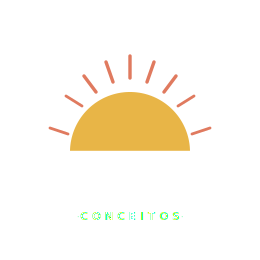

<div align="center">
  
  <h1>Conceitos</h1>
  <p>Imaginando um futuro digital para Moçambique.</p>
  <a href="https://conceitos.org">conceitos.org</a>
</div>

---

**Conceitos** é uma iniciativa cívica que reimagina serviços públicos digitais moçambicanos através de mocks e protótipos visuais. Cada projecto é um conjunto de interfaces clicáveis: ideias para conversar, criticar e melhorar, não software em produção.

Este repositório contém o código-fonte do site [conceitos.org](https://conceitos.org), servido via GitHub Pages.

## Projectos

| # | Projecto | Estado |
|---|----------|--------|
| 01 | [Saúde Digital](https://conceitos.org/saudedigital/) | Disponível |
| 02 | Governo Digital | Em ideação |
| 03 | Educação Digital | Em ideação |
| 04 | Finanças Digitais | Em ideação |
| 05 | Justiça Digital | Em ideação |

### Saúde Digital

Reimaginação da plataforma nacional de saúde com cinco superfícies interligadas: registo clínico electrónico (EMR), app do cidadão, farmácia comunitária, vigilância epidemiológica e auditoria clínica.

## Estrutura

```
conceitos/
├── index.html          # Página de entrada e directório de projectos
├── assets/             # Marca, SVGs partilhados
└── saudedigital/       # Projecto 01 · Saúde Digital
    ├── index.html
    ├── emr.html
    ├── ehealth.html
    ├── pharmacy.html
    ├── audit.html
    ├── surveillance.html
    ├── design-system.html
    ├── shared/styles.css
    └── DESIGN-*.md     # Documentação de desenho por subsistema
```

## Tecnologia

Site estático puro: HTML5, CSS3 com variáveis de design, SVG e JavaScript mínimo. Sem frameworks, sem bundlers, sem dependências de runtime.

## Aviso

Estes protótipos são conceitos visuais independentes, sem afiliação a qualquer entidade governamental, organização ou empresa. São exercícios de imaginação cívica partilhados em domínio público. Nenhum dado apresentado é real.

## Colaborar

Contribuições são bem-vindas: crítica de desenho, novas ideias de projectos, correcções ou melhorias de acessibilidade. Abre uma issue ou um pull request.

---

Domínio público. Sem reservas de direitos.
